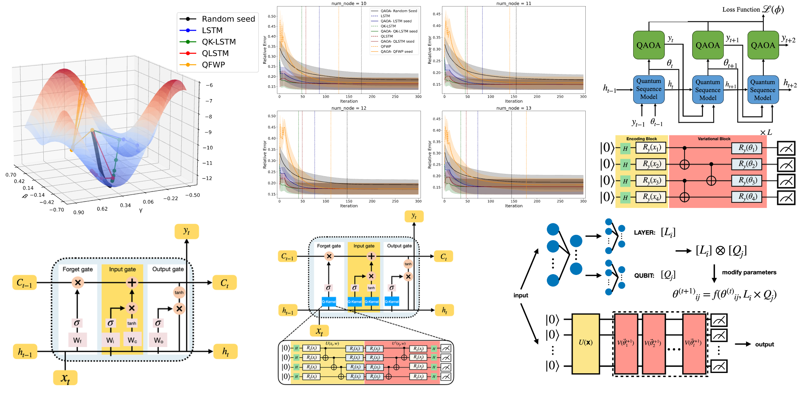

#  Meta-Learning for Quantum Optimization via  Quantum Sequence Model

<br>
<p align="center">
  
</p>

## Introduction
This is the offical repository of the paper Meta-Learning for Quantum Optimization via Quantum Sequence Model

The Quantum Approximate Optimization Algorithm (QAOA) is a leading approach for solving combinatorial optimization problems on near-term quantum processors. However, finding good variational parameters remains a significant challenge due to the non-convex energy landscape, often resulting in slow convergence and poor solution quality. In this work, we propose a quantum meta-learning framework that trains advanced quantum sequence models to generate effective parameter initialization policies. We investigate four classical or quantum sequence models, including the Quantum Kernel-based Long Short-Term Memory (QK-LSTM), as learned optimizers in a "learning to learn" paradigm. Our numerical experiments on the Max-Cut problem demonstrate that the QK-LSTM optimizer achieves superior performance, obtaining the highest approximation ratios and exhibiting the fastest convergence rate across all tested problem sizes ($n=10$ to $13$). Crucially, the QK-LSTM model achieves perfect parameter transferability by synthesizing a single, fixed set of near-optimal parameters, leading to a remarkable sustained acceleration of convergence even when generalizing to larger problems. This capability, enabled by the compact and expressive power of the quantum kernel architecture, underscores its effectiveness. The QK-LSTM, with only 43 trainable parameters, substantially outperforms the classical LSTM (56 parameters) and other quantum sequence models, establishing a robust pathway toward highly efficient parameter initialization for variational quantum algorithms in the NISQ era.

<div style="display: flex; align-items: center;">
<div style="flex: 1;">

## Installation
1. Create a new conda environment with Python 3.10.18:
   ```bash
   conda create --name [name] python=3.10
   ```
2. Activate the newly created environment:
   ```bash
   conda create [name] 
   ```
3. Install the required package using pip:
   ```bash
   pip install -r requirements.txt
   ```
## Options

## Usage

## News

<h2 id="citation">🔖 Citation</h2>

📚 If you find our work or this code to be useful in your own research, please kindly cite our paper :-)

<h2 id="authors">🖌️ Authors</h2>

[Yu-Cheng Lin](https://github.com/Xiezhihaa), [Yu Hsu](https://github.com/Astor-Hsu).
