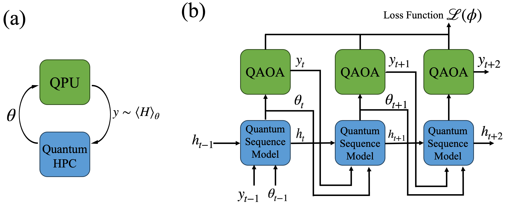

#  Meta-Learning for Quantum Optimization via  Quantum Sequence Model

<br>
<p align="center">
  
</p>

## Abstract
This is the offical repository of the paper "Meta-Learning for Quantum Optimization via Quantum Sequence Model"

The Quantum Approximate Optimization Algorithm (QAOA) is a leading approach for solving combinatorial optimization problems on near-term quantum processors. However, finding good variational parameters remains a significant challenge due to the non-convex energy landscape, often resulting in slow convergence and poor solution quality. In this work, we propose a quantum meta-learning framework that trains advanced quantum sequence models to generate effective parameter initialization policies. We investigate four classical or quantum sequence models, including the Quantum Kernel-based Long Short-Term Memory (QK-LSTM), as learned optimizers in a "learning to learn" paradigm. Our numerical experiments on the Max-Cut problem demonstrate that the QK-LSTM optimizer achieves superior performance, obtaining the highest approximation ratios and exhibiting the fastest convergence rate across all tested problem sizes ($n=10$ to $13$). Crucially, the QK-LSTM model achieves perfect parameter transferability by synthesizing a single, fixed set of near-optimal parameters, leading to a remarkable sustained acceleration of convergence even when generalizing to larger problems. This capability, enabled by the compact and expressive power of the quantum kernel architecture, underscores its effectiveness. The QK-LSTM, with only 43 trainable parameters, substantially outperforms the classical LSTM (56 parameters) and other quantum sequence models, establishing a robust pathway toward highly efficient parameter initialization for variational quantum algorithms in the NISQ era.

## Introduction

In this project, we address a major challenge in running variational quantum algorithma (VQA) like QAOA: finding the good starting point. The cost landscape for these algorithms is often like a rocky, unpredictable terrain, making the traditional search for the best "angles" (parameters) slow and inconsistent. Our appoach is inspired by the meta-learning framework developed by [Verdon](https://arxiv.org/abs/1907.05415) et al., which focuses on learning to learn optimization strategies. We extend this paradigm by training an intelligent sequence model—like a skilled quantum coach—to guide the optimization process. This coach is trained on many different random graph instances from the Max-Cut problem. Its job is to observe the current problem structure and quickly predict a highly effective initial parameter set. 

<br>
<p align="center">
  
</p>

Our optimization follows a two-phase strategy:

1.  Phase I (Sequence Model Guidance): The trained sequence model is used as a fast, black-box controller to optimize the QAOA parameters for a few initial steps.
2.  Phase II (Refinement): Once the sequence model has landed the parameters in a good region of the landscape, we switch to a common, robust optimizer (like ADAM) for fine-tuning and reaching the final minimum.

By employing both classical and quantum sequence models (including our novel QK-LSTM), we aim to find a universally good starting point that dramatically accelerates convergence across many different problem sizes.

<div style="display: flex; align-items: center;">
<div style="flex: 1;">

## 🛠️ Installation
We recommend setting up a dedicated Conda environment to manage dependencies: 
1. Create a new Conda environment with Python 3.10:
   ```bash
   conda create --name [your_env_name] python=3.10
   ```
2. Activate the newly created environment:
   ```bash
   conda create [your_env_name] 
   ```
3. Install the required package using pip:
   ```bash
   pip install -r requirements.txt
   ```
## Options
 - `--Train_and_Test`: Default is `True`. Set to `True` to run both training and testing phases sequentially.
 - `--Only_train`: Default is `False`. Set to `True` to perform training only (will save model checkpoint).
 - `--Only_test`: Default is `False`. Set to `True` to perform training only (will save model checkpoint).
 ### Device Arguments
  - `--device`: Default is `cpu`. Use `--device` to set the device to use for PyTorch computation (`cpu` or `cuda:0`).
  - `--backend_sequence`: Default is `lightning.qubit`. Use `--backend_sequence` to set the pennylane backend for the quantum sequence moodel.
  - `--backend_QAOA`: Default is `default.qubit`. Use `--backend_QAOA` to set the pennylane backend for the QAOA.
### Data Load and Save Path
  - `--dataset_save_path`: Default is `datasets.pkl`. Use `--dataset_save_path` to load your dataset file. 
  - `--model_save_path`: Default is `models_default`. Use `--model_save_path` to set the file name to save model parameters.
   - `--Results_save_path`: Default is `results_default`. Use `--Results_save_path` to set the file name to save test result (CSV, NPZ, SVG).
  - `--load_path`: Default is `None`. Use `--load_path` to load the pre-trained model parameters (`.pth` file) if you need.
### Model Arguments
 - `--model_type`: Use `--model_type` to set the type of sequence model, e.g. `LSTM`, `QK`,  `QLSTM`, `QFWP` . 
 - `--mapping_type`: Default is `ID`. Use `--mapping_type` to set the type of mapping model if you need (e.g., `Linear` or `ID` for identity).
 - `--layers`: Default is `1`. Use `--layers` to set the number of layers for the sequence model.
 - `--input_feature_dim`: Default is `2`. Use `--input_feature_dim` to set the number of parameters input to the sequence model (doesn't inclue one parameter for cost).
 - `--max_total_params`: Default is `2`. Use `--max_total_params` to set the number of parameter for the QAOA ansatz.
 - `--qubits`: Default is `4`. Use `--qubits` to set the number of qubits for the QK-LSTM and QLSTM model.
 - `--loss_function_type`: Default is `weighted`. Use `--loss_function_type` to set the type of meta-loss function, (e.g., `weighted` or `observed improvement`).
 - `--lr_sequence`: Default is `6e-6`. Use `--lr_sequence` to set the learning rate for the sequence model.
 - `--lr_mapping`: Default is `1e-4`. Use `--lr_mapping` to set the learning rate for the mapping model.
 - `--epochs`: Default is `50`. Use `--epochs` to set the number of training epochs.
 - `--steps_recurrent_loop_train`: Default is `10`. Use `--steps_recurrent_loop_train` to set the number of recurrent steps during training.
 - `--conv_tol_sequence`: Default is `1e-5`. Use `--conv_tol_sequence` to set the convergence tolerance for training.
 - `--time_out`: Default is `7200`. Use `--time_out` to set the timeout in seconds for training.
 - `--continue_train`: Default is `False`. Use `--continue_train` if yoy already have the model parameters file and you plan to continue tain.
 - `--steps_recurrent_loop_test`: Default is `10`. Use `--steps_recurrent_loop_test` to set the number of recurrent steps during testing (Phase I).

 ### QAOA MaxCut Arguments
 - `--qaoa_layers`: Default is `1`. Use `--qaoa_layers` to set the number of layers in QAOA MaxCut.
 - `--qaoa_optimizer`: Default is `SGD`. Use `--qaoa_optimizer` to set the optimizer for the QAOA optimization, e.g. `SGD` and `ADAM`.
 - `--lr_qaoa`: Default is `1e-3`. Use `--lr_qaoa` to set the learning rate for the QAOA optimization.
 - `--max_iter_qaoa`: Default is `300`. Use `--max_iter_qaoa` to set the max iterations for QAOA optimization.
 - `--conv_tol_qaoa`: Default is `1e-6`. Use `--conv_tol_qaoa` to set the convergence tolerance for QAOA optimization.


## 🚀 Usage
### Prepare dataset
The dataset file (`.pkl` format) must contain the `train_data`, `val_data`, and `test_data` sets. Each graph generated by the `networkx` package. You can also generate graph by yourself but the graph must possess the necessary attributes: `.nodes`, `.edges`, and `.edges.data("weight")`.

### Training and Testing Scenarios
#### Scenario A: Train and Test Model Sequentially (Default)
This is the standard workflow. The best model parameters found during training will be automatically loaded for the testing phase.
```bash
python main.py -- Train_and_Test True --dataset_save_path [dataset_path.pkl] --model_type QK --mapping_type Linear 
```
#### Scenario B: Only Train the Model
Use this if you want to train and save the model, and test it later.
```bash
python main.py -- Train_and_Test False --Only_train True --dataset_save_path [dataset_path.pkl] --model_type QK --mapping_type Linear
```
####  Scenario C: Only Test a Pre-trained Model
Use this when you have an existing ```.pth``` file and want to evaluate its performance on the test set.
```bash
python main.py -- Train_and_Test False --Only_test True --dataset_save_path [dataset_path.pkl] --load_path [your_model_params._path.pth] --model_type QK --mapping_type Linear
```

### Results
The model generates three main result file: 

the file include NumPy array of sequence model output and QAOA parameter history during test 
```
QAOA_Random_node_[nodes_of_the_graph]_edge_[edges_of_the_graph]_[i].npz
```
the file saves cost history in DataFrame format
```
[args.Results_save_path]_node_[nodes_of_the_graph]_edge_[edges_of_the_graph]_[i].csv
```
the file saves the convergence plot image 
```
Result_[args.Results_save_path]_node_[nodes_of_the_graph]_edges_[edges_of_the_graph]_[i].svg
```

When saving model checkpoints, the folder follows this format:

the model with the best validation performance 
```
best_[args.model_type]_model_[args.model_save_path].pth
```
the model at the end of the last training epoch
```
[Model_save_path]_[model_type]_[lr_sequence]_[lr_mapping].pth
```


## News
(Leave this section for future announcements.)

<h2 id="citation">🔖 Citation</h2>

📚 If you find our work or this code to be useful in your own research, please kindly cite our paper :-)

<h2 id="authors">🖌️ Authors</h2>

[Yu-Cheng Lin](https://github.com/Xiezhihaa), [Yu Hsu](https://github.com/Astor-Hsu).
